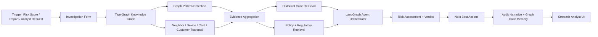

# Fraud Investigation Agent

A graph-grounded fraud investigation system built to analyze suspicious transactions in context, connect related entities, retrieve historical evidence, apply policy logic, and produce an auditable case outcome.

This project combines TigerGraph, LangGraph, retrieval-augmented generation, and a Streamlit analyst dashboard into a single investigation workflow for financial fraud review.

---

## What this project does

The system works like a fraud analyst assistant:

1. A transaction or customer alert is received.
2. The system inspects the graph to find connected cards, customers, devices, and prior activity.
3. It retrieves similar historical cases and relevant policy/regulatory guidance.
4. It identifies likely fraud patterns and risk signals.
5. It recommends the next best action under policy rules.
6. It writes an auditable case record and stores it as graph memory for future investigations.

The result is not just a score — it is a structured investigation with evidence, rationale, and action paths.

---

## High-level architecture



---

## End-to-end workflow

### 1. Triggered investigation
The workflow starts from a suspicious transaction or a manual analyst input. The app allows selecting a trigger source, transaction ID, and risk score.

### 2. Graph traversal and pattern detection
The system queries the TigerGraph graph to find:
- connected card activity
- customer behavior patterns
- device reuse
- related accounts and cards
- suspicious clusters and fan-out activity
- prior graph memory linked to the case

### 3. Historical memory retrieval
The system searches closed cases and prior investigations to find similar fraud patterns, historical exposure, and repeat behavior.

### 4. Policy and regulatory grounding
Relevant fraud rules and compliance guidance are retrieved to ensure the recommendation is tied to policy rather than only model output.

### 5. Reasoning and verdict generation
The agent combines:
- graph evidence
- precedent cases
- policy guidance
- trigger context

Then it decides on a verdict, confidence, and recommended action set.

### 6. Action routing and audit trail
The system distinguishes between:
- auto-executed actions
- escalated actions requiring analyst approval
- regulatory filings requiring stronger sign-off

This produces an auditable investigation trail instead of a black-box decision.

---

## Why graph-first fraud investigation matters

Fraud is rarely a single isolated event. It usually appears as a network-of-signals problem:

- the same device used across multiple cards
- burst activity in a short time window
- a customer operating outside their usual region
- repeated patterns seen in previous fraud cases
- a suspicious transaction connected to broader ring behavior

A table-only approach misses most of this. A graph-based approach makes the relationship explicit and explainable.

---

## Project stack

| Layer | Technology |
|---|---|
| Graph database | TigerGraph |
| Query layer | GSQL |
| Agent orchestration | LangGraph |
| Retrieval layer | GraphRAG + vector search |
| LLM integration | Configurable provider (Groq/OpenAI/Anthropic-style config pattern) |
| UI | Streamlit |
| Data modeling | Python + Pydantic |
| Workflow output | JSON benchmark files in `cases/` |

---

## Dataset overview

This project uses a fraud investigation benchmark built around a synthetic but realistic transaction and case dataset.

### Dataset files

- `data/raw/transactions.csv`  
  Transaction history with card, product, amount, risk, timestamps, and engineered features.

- `data/raw/identity.csv`  
  Online transaction identity metadata including device, browser, OS, proxy signals, and related profile information.

- `data/raw/closed_cases_history.csv`  
  Historical investigations used as memory and precedent for fraud pattern recognition.

- `data/raw/case_pack.csv`  
  The benchmark case pack used to trigger the 20 investigation scenarios.

### What the data represents

The dataset models a card-fraud environment where:
- transactions are tied to customer and card histories
- devices and regions can be shared across many cards
- fraud may involve burst activity, device fanout, impersonation, or coordinated ring behavior
- some cases are true fraud while others are legitimate activity that looks suspicious

This is intentionally designed to force the system to reason over connected behavior and not just model score alone.

---

## Fraud patterns covered

The repo includes logic and patterns for common fraud scenarios such as:

- card testing
- card-not-present fraud
- new-device fraud
- out-of-region activity
- account takeover
- fraud rings
- similar-case memory match

The dataset also includes a few undocumented or mixed-pattern cases, which is important because real fraud is not always perfectly labeled.

---

## Repository structure

```text
hhgoa-fraud-agent/
├── agent/
│   ├── config.py
│   ├── memory/
│   ├── models.py
│   ├── policy/
│   ├── prompts.py
│   ├── run.py
│   └── tools/
├── cases/
│   ├── HHG-001.json
│   ├── HHG-002.json
│   └── ...
├── data/
│   ├── raw/
│   └── processed/
├── docs/
│   ├── algorithms.md
│   ├── blog-post.md
│   ├── mcp-setup.md
│   ├── progress.md
│   ├── schema.md
│   └── ...
├── graph/
│   ├── build_txn_chain.gsql
│   ├── compute_customer_home_region.gsql
│   ├── compute_home_regions.py
│   ├── deploy_schema.py
│   ├── ingest_data.py
│   ├── install_queries.py
│   ├── queries/
│   ├── queries_client.py
│   └── schema.gsql
├── mcp/
│   ├── client.py
│   ├── server.py
│   └── tools.py
├── rag/
│   ├── evidence_gatherer.py
│   ├── policy_documents.py
│   ├── vector_store.py
│   └── __init__.py
├── tests/
│   ├── test_evidence_gatherer.py
│   ├── test_graph_queries.py
│   ├── test_mcp_integration.py
│   └── ...
├── ui/
│   └── app.py
├── requirements.txt
├── README.md
└── .env.example
```

---

## Key project modules

### `agent/`
Core workflow orchestration and investigation logic.

### `graph/`
TigerGraph schema, data loading jobs, and graph query implementations.

### `rag/`
Retrieval and semantic recall for prior cases, documents, and policy text.

### `mcp/`
TigerGraph MCP wrappers for model tool access.

### `ui/`
Streamlit analyst dashboard used to trigger investigations and view outputs.

### `cases/`
Generated benchmark answer files in the expected output format.

---

## How to run the app

### 1. Install dependencies

```bash
python -m venv .venv
.venv\Scripts\activate
pip install -r requirements.txt
```

### 2. Configure environment
Create a `.env` file with your TigerGraph and LLM configuration values.

### 3. Launch the Streamlit dashboard

```bash
python -m streamlit run ui/app.py --server.headless true --server.port 8501
```

Then open:
- http://localhost:8501

### 4. Run tests

```bash
python -m pytest -q
```

### 5. Generate benchmark outputs

```bash
python tests/run_benchmark.py
```

---

## Example investigation flow

A sample human workflow is:

- risk model flags suspicious transaction
- analyst opens case in the app
- graph extracts connected customers/cards/devices
- similar historical cases are retrieved
- policy rules are applied
- risk is reassessed with evidence
- recommended actions are produced
- case is stored for future reuse

This is the operational loop the project is designed to automate.

---

## Result

The project produces structured outputs including:
- verdict
- risk level
- fraud probability
- pattern summary
- evidence chain
- policy references
- next best actions
- SAR narrative when required
- graph memory for continuous learning

This makes the system practical for both demonstration and real operational review.

---

## Status

The repository contains the full project structure, investigation workflow, benchmark output generation, and analyst-facing UI. It is intended as a complete TigerGraph + agentic fraud investigation prototype.

---

## Project intent

This project demonstrates how modern AI systems can work with graph databases to support real-world fraud operations:

- faster investigation
- better evidence linkage
- explainable decisions
- policy-aware actions
- auditable case memory

It is designed to show that fraud detection is not only a score problem — it is a connected investigation problem.
